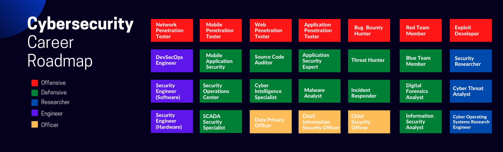

Cybersecurity Career Path ⬆️

⚠️ Not Include Responsibilities

⚠️ Education and Certification are Optional

## Offensive

- [Network Penetration Tester](Network_Penetration_Tester.md)
- [Mobile Penetration Tester](Mobile_Penetration_Tester.md)
- [Web Penetration Tester](Web_Penetration_Tester.md)
- [Application Penetration Tester](Application_Penetration_Tester.md)
- [Bug Bounty Hunter](Bug_Bounty_Hunter.md)
- [Red Team Member](Red-Team-Member.md)
- [Exploit Developer](Exploit_Developer.md)

## Defensive

- [Mobile Application Security](Mobile_Application_Security.md)
- [Source Code Auditor](Source_Code_Auditor.md)
- [Application Security Expert](Application_Security_Expert.md)
- [Threat Hunter](Threat_Hunter.md)
- [Blue Team Member](Blue-Team_Member.md)
- [Security Operation Center](Security_Operation_Center.md)
- [Cyber Threat Analyst](Cyber_Threat_Analyst.md)
- [Malware Analyst](Malware_Analyst.md)
- [Incident Responder](Incident_Responder.md)
- [Digital Forensic Analyst](Digital_Forensic_Analyst.md)
- [SCADA Security Specialist](SCADA_Security_Specialist.md)
- [Information Security Analyst](Information_Security_Analyst.md)
 

## Researcher

- [Security Researcher](Security_Researcher.md)
- [Cyber Threat Analyst](Cyber_Threat_Analyst.md)
- [Cyber Operation Systems Research Engineer](Cyber_Operation_Systems_Research_Engineer.md)

## Engineer

- [DevSecOps Engineer](DevSecOps_Engineer.md)
- [Security Engineer(Software)](<Security_Engineer(Software).md>)
- [Security Engineer(Hardware)](<Security_Engineer(Hardware).md>)

## Officer

- [Data Privacy Officer](Data_Privacy_Officer.md)
- [Chief Information Security Officer](Chief_Information_Security_Officer.md)
- [Chief Security Officer](Chief_Security_Officer.md)
